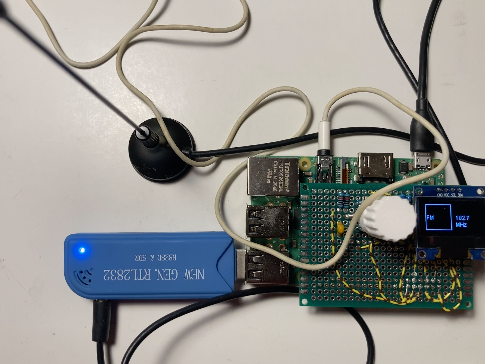

# Portable SDR Pi
A portable SDR solution to listen to anything from FM radio to airband.

The setup looks as follows

## Feature ideas
- Possibility to use presets
  - Airband (quickly jump to right frequency range)
  - Marine VHF radio (channel presets)
  - 27 MHz Citizens band channel presets
- More decoding functionality
  - VOR decoding
  - RDS decoding

On the hardware side
- Neat enclosure
- Proper controls, multiple knobs and proper screen
- Little audio amplifier and built-in speakers
- Possibilty to plug into 12V adapter, or maybe via USB (for use in car)
